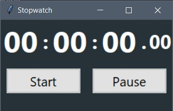

This stopwatch can be use during competitive programming for measuring time take in each question.
To become faster in Competitive programming this stopwatch canbe helpfull\
I have made dark theme for making UI of stopwatch\
I am using python version = 3.8.2



For running this stopwatch
1. By python command
```json
    python stopwatch.py
```
2. By making exe file (for using in real time)
```json
    pip install pyinstaller
    pyinstaller -w -F stopwatch.py
```